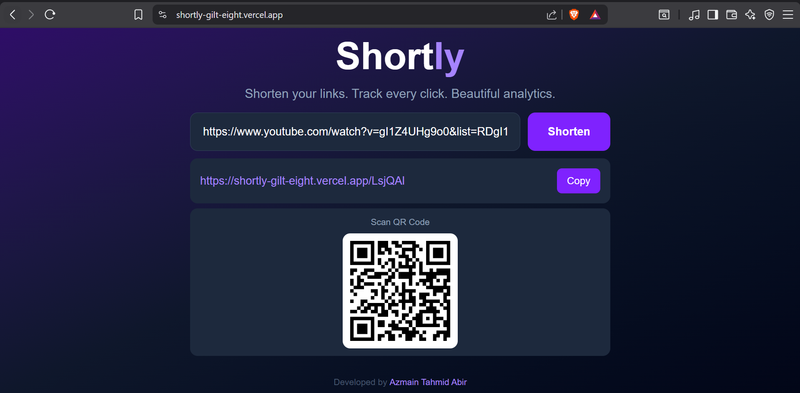

# ?? Shortly — Modern URL Shortener with Analytics




> A fast, modern URL shortener that turns long links into clean short ones, tracks every click, and generates a scannable QR code for each link.

?? **[Live Demo](https://shortly-gilt-eight.vercel.app)** | ????? **[GitHub](https://github.com/azmainabir/shortly)**

---

## ? Features

- ?? Instantly shorten any long URL
- ?? Click counting for every link
- ?? QR code generation for every short link
- ?? One-click copy to clipboard
- ? Instant redirects from short link to original URL
- ?? Beautiful dark mode UI

## ?? Roadmap (Coming Soon)

- ?? Geolocation tracking (country, city)
- ?? Device and browser detection
- ?? Full analytics dashboard
- ?? User authentication with Google
- ? Redis caching for faster redirects

## ??? Tech Stack

| Layer | Technology |
|---|---|
| Frontend | Next.js, TypeScript, Tailwind CSS |
| Backend | Next.js API Routes |
| Database | PostgreSQL (Supabase) |
| Deployment | Vercel |

## ?? Getting Started

### Prerequisites
- Node.js 18+
- npm
- Supabase account

### Installation

1. Clone the repository:
```bash
git clone https://github.com/azmainabir/shortly.git
cd shortly
```

2. Install dependencies:
```bash
npm install
```

3. Create a `.env.local` file:
```env
NEXT_PUBLIC_SUPABASE_URL=your_supabase_url
NEXT_PUBLIC_SUPABASE_PUBLISHABLE_KEY=your_supabase_key
NEXT_PUBLIC_APP_URL=http://localhost:3000
```

4. Run the development server:
```bash
npm run dev
```

Open [http://localhost:3000](http://localhost:3000) in your browser.

## ?? Project Structure

shortly/

+-- app/

¦   +-- [code]/         # Dynamic redirect page

¦   +-- api/shorten/    # URL shortening API

¦   +-- api/health/     # Health check endpoint

¦   +-- page.tsx        # Homepage

¦   +-- layout.tsx      # Root layout

+-- lib/

¦   +-- supabase.ts     # Database client

+-- public/

+-- preview.png     # App screenshot

## ??? Database Schema

```sql
-- Links table
links (id, original_url, short_code, created_at, click_count)

-- Clicks table
clicks (id, link_id, clicked_at, country, device_type, browser)
```

## ?? What I Learned

Building Shortly taught me how a full-stack app fits together end to end — designing a database schema, building API routes, connecting a frontend to a backend, handling dynamic routing for redirects, and deploying to production with automatic CI/CD. If I rebuilt it, I would add Redis caching from the start to make redirects even faster and implement the analytics dashboard as a core feature rather than a future step.

## ?? Deployment

This project is deployed on Vercel. Every push to the `main` branch triggers an automatic deployment.

## ????? Developer

**Azmain Tahmid Abir**
CSE Student @ Daffodil International University
On a mission to master Data Science · AI Engineering · Cyber Security · Software Development

[](https://www.linkedin.com/in/azmain-abir)
[](https://github.com/azmainabir)

## ?? License

MIT License — feel free to use this project for learning or personal use.

---

<p align="center">Developed with ?? by <strong><a href="https://www.linkedin.com/in/azmain-abir">Azmain Tahmid Abir</a></strong></p>

